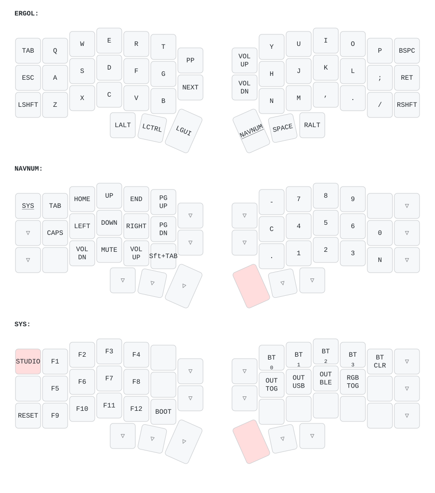

# zmk-config

Configuration [ZMK](https://zmk.dev) personnelle pour un **Corne Choc Pro BT** (Keebart)
en disposition **[Ergo-L](https://ergol.org)**.

Fork de [Keebart/zmk-config](https://github.com/Keebart/zmk-config), dont il conserve
les définitions de cartes et les deux autres claviers de la gamme.

## Pourquoi ce dépôt

Le clavier est livré en QWERTY. Ce dépôt en fait un clavier Ergo-L, une disposition
francophone qui réduit les déplacements des doigts et les enchaînements inconfortables,
tout en gardant `ctrl+z/x/c/v` accessibles à la main gauche.

Il sert aussi de source de vérité : le firmware se compile en CI à chaque push, et le
schéma ci-dessous est régénéré automatiquement à partir du keymap, donc il ne peut pas
se désynchroniser.

## Le clavier n'émule pas Ergo-L

C'est le point le plus important à comprendre avant de toucher au keymap.

Un clavier n'envoie pas des lettres, il envoie des **codes de touche**. C'est le pilote
installé sur le système d'exploitation qui décide quel caractère produire. Ici le clavier
envoie des codes **US bruts**, exactement comme un clavier QWERTY, et c'est le pilote
Ergo-L qui fait apparaître les bons caractères.

Pour la touche à droite du `q`, par exemple :

| | code envoyé par le clavier | caractère obtenu |
|---|---|---|
| sans pilote Ergo-L | `W` | `w` |
| avec le pilote Ergo-L | `W` | `c` |

**Sans le pilote installé, le clavier tape en QWERTY.** L'installation se fait sur la
machine, pas ici : voir [ergol.org](https://ergol.org).

C'est la méthode recommandée par ergol.org, et émuler la disposition dans le firmware est
explicitement déconseillé : cela casserait la touche morte 1DK, les caractères accentués
et la cohérence avec les autres périphériques de saisie.

En pratique, dans `config/corne_choc_pro.keymap` :

- les `#define EL_*` ne servent qu'à la lisibilité — `#define EL_C W` se lit « la touche
  qui produit un `c` sous Ergo-L est celle dont le code est `W` » ;
- `&kp EL_C` se résout en `&kp W`, jamais en une macro Unicode ;
- aucune macro, aucun caractère non-ASCII, aucune translation.

Les 30 touches du pavé central envoient donc exactement les mêmes codes que le firmware
d'origine. Le bandeau en commentaire au-dessus de la couche de base montre les deux
lectures côte à côte : les caractères à l'écran d'un côté, les codes US envoyés de l'autre.

## Le schéma



Généré par [keymap-drawer](https://github.com/caksoylar/keymap-drawer) via
`.github/workflows/draw.yml`, à chaque modification du keymap ou de la géométrie.

Attention à la lecture : le schéma affiche `Q W E R T`, pas `q c o p w`. Il est produit
à partir du firmware, et le firmware envoie bien du US — c'est exactement le principe
décrit ci-dessus. Pour savoir quel caractère sort réellement, il faut lire ce schéma à
travers la table de correspondance d'Ergo-L, que reprend le bandeau en commentaire du
keymap.

## Les couches

| Couche | Accès | Contenu |
|---|---|---|
| `ERGOL` | permanente | lettres et ponctuation Ergo-L, média sur les colonnes centrales |
| `NAVNUM` | pouce droit intérieur | navigation en croix et média à gauche, pavé numérique à droite |
| `SYS` | `NAVNUM` + touche en haut à gauche | F1-F12, Bluetooth, sortie USB/BLE, RGB, bootloader |
| `EXTRA 1-3` | — | vides, réservées à ZMK Studio |

Les modifieurs sont sous les pouces — Alt / Ctrl / Cmd à gauche, Nav / Espace / AltGr à
droite. **Pas de homerow mods**, donc aucun `hold-tap`, aucun `tapping-term-ms` à régler
et aucun faux positif en frappe rapide. Le keymap ne contient aucun bloc `behaviors`.

Sur `NAVNUM`, les chiffres utilisent les codes de la rangée principale (`N1`..`N0`) et non
le pavé numérique : Ergo-L place les chiffres en accès direct, donc Maj sur ces mêmes
touches donne `€ « » $ % ^ & * # @` sans binding supplémentaire.

Sur `SYS`, `&studio_unlock`, `&sys_reset` et `&bootloader` sont volontairement sur la
**main gauche** : ces comportements s'exécutent sur la moitié maîtresse.

## Compiler et flasher

Le firmware se compile en CI. Aucun outil à installer en local.

1. Pousser sur n'importe quelle branche — le workflow `Build ZMK firmware` démarre.
2. Télécharger l'artefact `firmware` depuis la page du run dans l'onglet Actions.
3. Mettre une moitié en mode bootloader : double-appui rapide sur le bouton reset. Un
   volume USB apparaît.
4. Y copier le `.uf2` correspondant à cette moitié. La carte redémarre seule.
5. Recommencer pour l'autre moitié.

En cas de comportement erratique après un changement de disposition, flasher d'abord les
`.uf2` `settings_reset` sur les deux moitiés pour effacer les réglages persistés, puis
reflasher le firmware normal.

## Modifier la disposition

Deux voies :

- **[ZMK Studio](https://zmk.dev/docs/features/studio)**, à chaud, sans recompiler.
  Activé sur la moitié gauche. Déverrouiller avec `&studio_unlock`, en haut à gauche de
  la couche `SYS`. Les couches `EXTRA` sont là pour ça.
- **Éditer `config/corne_choc_pro.keymap`** et pousser. C'est la voie à privilégier pour
  tout ce qui doit être versionné — Studio ne réécrit pas le fichier.

L'ordre des 46 bindings est imposé par le `matrix-transform` de la carte :

```
   0  1  2  3  4  5 |  6  7 |  8  9 10 11 12 13
  14 15 16 17 18 19 | 20 21 | 22 23 24 25 26 27
  28 29 30 31 32 33 |       | 34 35 36 37 38 39
           40 41 42 |       | 43 44 45
```

Côté droit, les colonnes vont de l'intérieur vers l'extérieur.

## Organisation du dépôt

| Chemin | Rôle |
|---|---|
| `config/corne_choc_pro.keymap` | la disposition Ergo-L |
| `config/corne_choc_pro.json` | géométrie physique, lue par Studio et keymap-drawer |
| `config/west.yml` | version de ZMK utilisée |
| `build.yaml` | matrice de compilation (cartes et shields) |
| `boards/` | définitions des cartes, héritées du fork |
| `keymap-drawer/` | schéma généré, ne pas éditer à la main |
| `keymap_drawer.config.yaml` | réglages du rendu |

Les keymaps `piantor_pro_bt` et `sofle_choc_pro` viennent du dépôt d'origine et sont
laissés inchangés. Ils continuent d'être compilés par la CI.
